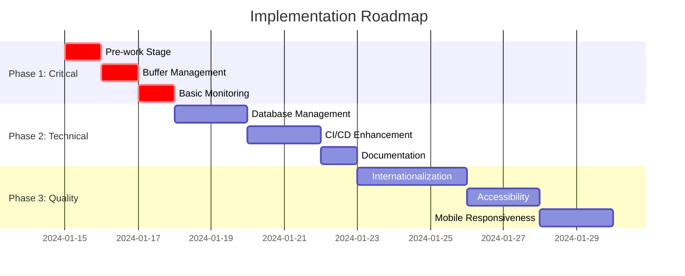

# 🗺️ Implementation Roadmap

**Приоритет**: 🔥 Критично
**Общее время**: 2-3 недели
**Команда**: Full-stack development team

---

## 📅 Timeline Overview



---

## 🚀 Phase 1: Critical Improvements (3 дня)

### Day 1: Pre-work Preparation

**Время**: 8 часов
**Ответственный**: DevOps Engineer + Senior Developer

#### Morning (4 часа)

**9:00 - 11:00: Environment Setup**

```bash
# Создание скриптов проверки среды
mkdir -p scripts/health-checks

# Скрипт проверки переменных окружения
cat > scripts/health-checks/validate-env.js << 'EOF'
const requiredEnvVars = [
  'DATABASE_URL',
  'REDIS_URL',
  'JWT_SECRET',
  'API_BASE_URL',
  'SENTRY_DSN'
];

const missingVars = requiredEnvVars.filter(varName => !process.env[varName]);

if (missingVars.length > 0) {
  console.error('❌ Missing environment variables:', missingVars);
  process.exit(1);
}

console.log('✅ All environment variables are set');
EOF

# Скрипт проверки сервисов
cat > scripts/health-checks/check-services.js << 'EOF'
const axios = require('axios');
const Redis = require('redis');
const { Pool } = require('pg');

async function checkDatabase() {
  const pool = new Pool({ connectionString: process.env.DATABASE_URL });
  try {
    await pool.query('SELECT 1');
    console.log('✅ Database connection successful');
    return true;
  } catch (error) {
    console.error('❌ Database connection failed:', error.message);
    return false;
  } finally {
    await pool.end();
  }
}

async function checkRedis() {
  const client = Redis.createClient({ url: process.env.REDIS_URL });
  try {
    await client.connect();
    await client.ping();
    console.log('✅ Redis connection successful');
    return true;
  } catch (error) {
    console.error('❌ Redis connection failed:', error.message);
    return false;
  } finally {
    await client.quit();
  }
}

async function checkExternalAPIs() {
  const apis = [
    { name: 'Meat API', url: process.env.MEAT_API_URL + '/health' },
    { name: 'Analytics API', url: process.env.ANALYTICS_API_URL + '/status' }
  ];

  const results = await Promise.allSettled(
    apis.map(async api => {
      const response = await axios.get(api.url, { timeout: 5000 });
      console.log(`✅ ${api.name} is accessible`);
      return true;
    })
  );

  const failures = results.filter(result => result.status === 'rejected');
  if (failures.length > 0) {
    console.error(`❌ ${failures.length} external APIs are not accessible`);
    return false;
  }

  return true;
}

async function main() {
  const checks = await Promise.all([
    checkDatabase(),
    checkRedis(),
    checkExternalAPIs()
  ]);

  if (checks.every(check => check)) {
    console.log('🎉 All services are healthy');
    process.exit(0);
  } else {
    console.error('💥 Some services are unhealthy');
    process.exit(1);
  }
}

main().catch(console.error);
EOF
```

**11:00 - 13:00: Backup and Git Management**

```bash
# Скрипт автоматического backup
cat > scripts/backup-project.sh << 'EOF'
#!/bin/bash

# Создание timestamp
TIMESTAMP=$(date +"%Y%m%d_%H%M%S")
BACKUP_DIR="backups/$TIMESTAMP"

# Создание директории backup
mkdir -p "$BACKUP_DIR"

# Git backup
echo "📦 Creating Git backup..."
git bundle create "$BACKUP_DIR/project.bundle" --all

# Database backup
echo "🗄️ Creating database backup..."
pg_dump $DATABASE_URL > "$BACKUP_DIR/database.sql"

# Environment backup
echo "⚙️ Backing up environment..."
cp .env "$BACKUP_DIR/.env.backup"

# Package files backup
echo "📋 Backing up package files..."
cp package.json "$BACKUP_DIR/package.json.backup"
cp package-lock.json "$BACKUP_DIR/package-lock.json.backup"

echo "✅ Backup completed: $BACKUP_DIR"
EOF

chmod +x scripts/backup-project.sh

# Скрипт проверки Git статуса
cat > scripts/git-status-check.js << 'EOF'
const { execSync } = require('child_process');

function checkGitStatus() {
  try {
    // Проверка uncommitted changes
    const status = execSync('git status --porcelain', { encoding: 'utf8' });
    if (status.trim()) {
      console.log('⚠️ Uncommitted changes detected:');
      console.log(status);

      const answer = require('readline-sync').question('Continue anyway? (y/N): ');
      if (answer.toLowerCase() !== 'y') {
        console.log('❌ Aborting due to uncommitted changes');
        process.exit(1);
      }
    }

    // Проверка unpushed commits
    const unpushed = execSync('git log @{u}..HEAD --oneline', { encoding: 'utf8' });
    if (unpushed.trim()) {
      console.log('⚠️ Unpushed commits detected:');
      console.log(unpushed);
    }

    console.log('✅ Git status check completed');
  } catch (error) {
    console.error('❌ Git status check failed:', error.message);
    process.exit(1);
  }
}

checkGitStatus();
EOF
```

#### Afternoon (4 часа)

**14:00 - 16:00: Integration with Existing Plan**

````bash
# Обновление package.json с новыми скриптами
npm pkg set scripts.precheck="node scripts/health-checks/validate-env.js && node scripts/health-checks/check-services.js"
npm pkg set scripts.backup="./scripts/backup-project.sh"
npm pkg set scripts.git-check="node scripts/git-status-check.js"
npm pkg set scripts.stage0="npm run git-check && npm run precheck && npm run backup"

# Создание Stage 0 в DAILY_WORK_PLAN.md
cat >> DAILY_WORK_PLAN.md << 'EOF'

## 🔧 Stage 0: Pre-work Preparation (30 минут)

**Приоритет**: 🔥 Критично
**Время**: 30 минут
**Ответственный**: DevOps Engineer

### Задачи:

1. **Environment Check** (10 минут)
   ```bash
   npm run precheck
````

- Проверка переменных окружения
- Проверка доступности сервисов
- Валидация конфигурации

2. **Git Status Validation** (5 минут)

   ```bash
   npm run git-check
   ```

   - Проверка uncommitted changes
   - Проверка unpushed commits
   - Валидация branch status

3. **Project Backup** (10 минут)

   ```bash
   npm run backup
   ```

   - Git bundle backup
   - Database backup
   - Configuration backup

4. **Resource Check** (5 минут)
   ```bash
   # Проверка системных ресурсов
   node scripts/check-resources.js
   ```
   - Memory usage
   - Disk space
   - CPU load

### Критерии успеха:

- ✅ Все переменные окружения настроены
- ✅ Внешние сервисы доступны
- ✅ Git репозиторий в чистом состоянии
- ✅ Backup создан и проверен
- ✅ Системные ресурсы достаточны

### При неудаче:

- 🔄 Исправить проблемы с окружением
- 🔄 Commit/push изменения
- 🔄 Освободить системные ресурсы
- ❌ Не продолжать без успешного Stage 0
  EOF

````

**16:00 - 18:00: Testing and Validation**
```bash
# Тестирование всех скриптов
npm run stage0

# Создание документации
cat > docs/STAGE_0_GUIDE.md << 'EOF'
# Stage 0: Pre-work Preparation Guide

## Цель
Обеспечить готовность среды разработки перед началом основных работ.

## Автоматические проверки

### Environment Variables
- DATABASE_URL
- REDIS_URL
- JWT_SECRET
- API_BASE_URL
- SENTRY_DSN

### Service Health
- PostgreSQL database
- Redis cache
- External APIs

### Git Status
- Uncommitted changes
- Unpushed commits
- Branch status

### System Resources
- Memory usage < 80%
- Disk space > 2GB
- CPU load < 70%

## Manual Checks

1. **Team Communication**
   - [ ] Team notified about start
   - [ ] Stakeholders informed
   - [ ] Support team on standby

2. **Monitoring Setup**
   - [ ] Monitoring dashboards open
   - [ ] Alert channels active
   - [ ] Logging systems ready

3. **Rollback Preparation**
   - [ ] Rollback plan reviewed
   - [ ] Previous stable version identified
   - [ ] Rollback scripts tested

## Troubleshooting

### Common Issues

**Environment Variables Missing**
```bash
# Copy from template
cp .env.example .env
# Edit with correct values
vim .env
````

**Service Unavailable**

```bash
# Check service status
docker-compose ps
# Restart if needed
docker-compose restart
```

**Git Issues**

```bash
# Stash changes
git stash push -m "Pre-stage stash"
# Or commit
git add . && git commit -m "Pre-stage commit"
```

EOF

````

### Day 2: Buffer Time Management

**Время**: 6 часов
**Ответственный**: Project Manager + Senior Developer

#### Morning (3 часа)

**9:00 - 12:00: Buffer Time Calculator**
```javascript
// scripts/buffer-calculator.js
class BufferTimeCalculator {
  constructor() {
    this.baseBufferPercentage = 15; // 15% базовый буфер
    this.complexityMultipliers = {
      low: 1.0,
      medium: 1.2,
      high: 1.5,
      critical: 2.0
    };
    this.riskMultipliers = {
      low: 1.0,
      medium: 1.3,
      high: 1.6,
      critical: 2.2
    };
  }

  calculateBuffer(baseTime, complexity = 'medium', risk = 'medium') {
    const complexityMultiplier = this.complexityMultipliers[complexity] || 1.2;
    const riskMultiplier = this.riskMultipliers[risk] || 1.3;

    const bufferPercentage = this.baseBufferPercentage * complexityMultiplier * riskMultiplier;
    const bufferTime = Math.ceil(baseTime * (bufferPercentage / 100));

    return {
      baseTime,
      bufferTime,
      totalTime: baseTime + bufferTime,
      bufferPercentage: Math.round(bufferPercentage)
    };
  }

  generateTimelineWithBuffers(stages) {
    return stages.map(stage => {
      const calculation = this.calculateBuffer(
        stage.estimatedTime,
        stage.complexity,
        stage.risk
      );

      return {
        ...stage,
        ...calculation,
        startTime: null, // Будет рассчитано при планировании
        endTime: null
      };
    });
  }
}

// Пример использования
const calculator = new BufferTimeCalculator();

const stages = [
  {
    name: 'TypeScript Fixes',
    estimatedTime: 45,
    complexity: 'medium',
    risk: 'low'
  },
  {
    name: 'API Documentation',
    estimatedTime: 60,
    complexity: 'low',
    risk: 'low'
  },
  {
    name: 'Security Implementation',
    estimatedTime: 90,
    complexity: 'high',
    risk: 'high'
  }
];

const timeline = calculator.generateTimelineWithBuffers(stages);
console.log('Timeline with buffers:', JSON.stringify(timeline, null, 2));

module.exports = BufferTimeCalculator;
````

#### Afternoon (3 часа)

**13:00 - 16:00: Fallback Plans Generator**

```javascript
// scripts/fallback-plans.js
class FallbackPlansGenerator {
  constructor() {
    this.planTypes = {
      A: 'Optimal Solution',
      B: 'Alternative Approach',
      C: 'Minimal Viable Solution',
      D: 'Emergency Fallback',
    };
  }

  generateFallbackPlans(stage) {
    const plans = {
      planA: this.generateOptimalPlan(stage),
      planB: this.generateAlternativePlan(stage),
      planC: this.generateMinimalPlan(stage),
      planD: this.generateEmergencyPlan(stage),
    };

    return {
      stageName: stage.name,
      plans,
      decisionMatrix: this.generateDecisionMatrix(stage),
      escalationPath: this.generateEscalationPath(stage),
    };
  }

  generateOptimalPlan(stage) {
    return {
      description: `Complete implementation of ${stage.name} with all requirements`,
      timeRequired: stage.estimatedTime,
      resources: stage.resources || ['Senior Developer'],
      risks: ['Time overrun', 'Technical complexity'],
      successCriteria: stage.successCriteria || [],
      rollbackPlan: 'Revert to previous stable state',
    };
  }

  generateAlternativePlan(stage) {
    return {
      description: `Alternative approach for ${stage.name} using different methodology`,
      timeRequired: Math.ceil(stage.estimatedTime * 1.2),
      resources: ['Senior Developer', 'DevOps Engineer'],
      risks: ['Learning curve', 'Integration issues'],
      successCriteria: stage.successCriteria?.slice(0, -1) || [],
      rollbackPlan: 'Switch to Plan C if issues persist',
    };
  }

  generateMinimalPlan(stage) {
    return {
      description: `Minimal viable implementation of ${stage.name}`,
      timeRequired: Math.ceil(stage.estimatedTime * 0.6),
      resources: ['Any available developer'],
      risks: ['Reduced functionality', 'Technical debt'],
      successCriteria: stage.successCriteria?.slice(0, 2) || [],
      rollbackPlan: 'Document as known limitation',
    };
  }

  generateEmergencyPlan(stage) {
    return {
      description: `Emergency workaround for ${stage.name}`,
      timeRequired: Math.ceil(stage.estimatedTime * 0.3),
      resources: ['Any team member'],
      risks: ['High technical debt', 'User experience impact'],
      successCriteria: ['Basic functionality works'],
      rollbackPlan: 'Add to technical debt backlog',
    };
  }

  generateDecisionMatrix(stage) {
    return {
      timeConstraints: {
        tight: 'Use Plan C or D',
        moderate: 'Use Plan A or B',
        flexible: 'Use Plan A',
      },
      resourceAvailability: {
        limited: 'Use Plan C or D',
        moderate: 'Use Plan B',
        full: 'Use Plan A',
      },
      riskTolerance: {
        low: 'Use Plan A',
        medium: 'Use Plan B',
        high: 'Use Plan C or D',
      },
    };
  }

  generateEscalationPath(stage) {
    return [
      {
        trigger: 'Plan A fails or exceeds time by 50%',
        action: 'Switch to Plan B',
        approver: 'Tech Lead',
      },
      {
        trigger: 'Plan B fails or exceeds time by 30%',
        action: 'Switch to Plan C',
        approver: 'Project Manager',
      },
      {
        trigger: 'Plan C fails or critical blocker',
        action: 'Switch to Plan D',
        approver: 'Engineering Manager',
      },
      {
        trigger: 'All plans fail',
        action: 'Escalate to leadership team',
        approver: 'CTO',
      },
    ];
  }
}

module.exports = FallbackPlansGenerator;
```

### Day 3: Basic Monitoring Setup

**Время**: 8 часов
**Ответственный**: DevOps Engineer + Backend Developer

#### Morning (4 часа)

**9:00 - 13:00: Health Check System**

```typescript
// lib/monitoring/health-check.ts
import { NextApiRequest, NextApiResponse } from 'next';
import { Pool } from 'pg';
import Redis from 'redis';
import axios from 'axios';

interface HealthCheck {
  service: string;
  status: 'healthy' | 'unhealthy' | 'degraded';
  responseTime: number;
  details?: any;
  error?: string;
}

interface HealthReport {
  status: 'healthy' | 'unhealthy' | 'degraded';
  timestamp: string;
  uptime: number;
  version: string;
  checks: HealthCheck[];
  summary: {
    total: number;
    healthy: number;
    unhealthy: number;
    degraded: number;
  };
}

class HealthCheckService {
  private dbPool: Pool;
  private redisClient: any;

  constructor() {
    this.dbPool = new Pool({
      connectionString: process.env.DATABASE_URL,
      max: 1, // Минимальное количество соединений для health check
    });

    this.redisClient = Redis.createClient({
      url: process.env.REDIS_URL,
    });
  }

  async checkDatabase(): Promise<HealthCheck> {
    const start = Date.now();
    try {
      const result = await this.dbPool.query('SELECT 1 as health_check');
      const responseTime = Date.now() - start;

      return {
        service: 'database',
        status: responseTime < 1000 ? 'healthy' : 'degraded',
        responseTime,
        details: {
          query: 'SELECT 1',
          result: result.rows[0],
        },
      };
    } catch (error) {
      return {
        service: 'database',
        status: 'unhealthy',
        responseTime: Date.now() - start,
        error: error instanceof Error ? error.message : 'Unknown error',
      };
    }
  }

  async checkRedis(): Promise<HealthCheck> {
    const start = Date.now();
    try {
      if (!this.redisClient.isOpen) {
        await this.redisClient.connect();
      }

      const testKey = `health_check_${Date.now()}`;
      await this.redisClient.set(testKey, 'ok', { EX: 10 });
      const value = await this.redisClient.get(testKey);
      await this.redisClient.del(testKey);

      const responseTime = Date.now() - start;

      return {
        service: 'redis',
        status: responseTime < 500 ? 'healthy' : 'degraded',
        responseTime,
        details: {
          operation: 'set/get/del',
          value,
        },
      };
    } catch (error) {
      return {
        service: 'redis',
        status: 'unhealthy',
        responseTime: Date.now() - start,
        error: error instanceof Error ? error.message : 'Unknown error',
      };
    }
  }

  async checkExternalAPI(name: string, url: string): Promise<HealthCheck> {
    const start = Date.now();
    try {
      const response = await axios.get(url, {
        timeout: 5000,
        headers: {
          'User-Agent': 'HealthCheck/1.0',
        },
      });

      const responseTime = Date.now() - start;

      return {
        service: name,
        status: response.status === 200 && responseTime < 3000 ? 'healthy' : 'degraded',
        responseTime,
        details: {
          statusCode: response.status,
          url,
        },
      };
    } catch (error) {
      return {
        service: name,
        status: 'unhealthy',
        responseTime: Date.now() - start,
        error: error instanceof Error ? error.message : 'Unknown error',
      };
    }
  }

  async performHealthCheck(): Promise<HealthReport> {
    const startTime = Date.now();

    const checks = await Promise.all([
      this.checkDatabase(),
      this.checkRedis(),
      this.checkExternalAPI('meat-api', process.env.MEAT_API_URL + '/health'),
      this.checkExternalAPI('analytics-api', process.env.ANALYTICS_API_URL + '/status'),
    ]);

    const summary = {
      total: checks.length,
      healthy: checks.filter(c => c.status === 'healthy').length,
      unhealthy: checks.filter(c => c.status === 'unhealthy').length,
      degraded: checks.filter(c => c.status === 'degraded').length,
    };

    const overallStatus =
      summary.unhealthy > 0 ? 'unhealthy' : summary.degraded > 0 ? 'degraded' : 'healthy';

    return {
      status: overallStatus,
      timestamp: new Date().toISOString(),
      uptime: process.uptime(),
      version: process.env.APP_VERSION || '1.0.0',
      checks,
      summary,
    };
  }

  async cleanup() {
    await this.dbPool.end();
    if (this.redisClient.isOpen) {
      await this.redisClient.quit();
    }
  }
}

// API endpoint
export default async function handler(req: NextApiRequest, res: NextApiResponse<HealthReport>) {
  if (req.method !== 'GET') {
    return res.status(405).json({ error: 'Method not allowed' } as any);
  }

  const healthService = new HealthCheckService();

  try {
    const report = await healthService.performHealthCheck();

    const statusCode = report.status === 'healthy' ? 200 : report.status === 'degraded' ? 200 : 503;

    res.status(statusCode).json(report);
  } catch (error) {
    res.status(500).json({
      status: 'unhealthy',
      timestamp: new Date().toISOString(),
      error: error instanceof Error ? error.message : 'Unknown error',
    } as any);
  } finally {
    await healthService.cleanup();
  }
}
```

#### Afternoon (4 часа)

**14:00 - 18:00: Monitoring Dashboard**

```typescript
// components/monitoring/HealthDashboard.tsx
import React, { useState, useEffect } from 'react';
import { Card, CardContent, CardHeader, CardTitle } from '@/components/ui/card';
import { Badge } from '@/components/ui/badge';
import { Alert, AlertDescription } from '@/components/ui/alert';
import { RefreshCw, CheckCircle, XCircle, AlertTriangle } from 'lucide-react';

interface HealthCheck {
  service: string;
  status: 'healthy' | 'unhealthy' | 'degraded';
  responseTime: number;
  details?: any;
  error?: string;
}

interface HealthReport {
  status: 'healthy' | 'unhealthy' | 'degraded';
  timestamp: string;
  uptime: number;
  version: string;
  checks: HealthCheck[];
  summary: {
    total: number;
    healthy: number;
    unhealthy: number;
    degraded: number;
  };
}

const HealthDashboard: React.FC = () => {
  const [healthData, setHealthData] = useState<HealthReport | null>(null);
  const [loading, setLoading] = useState(true);
  const [lastUpdated, setLastUpdated] = useState<Date | null>(null);

  const fetchHealthData = async () => {
    try {
      setLoading(true);
      const response = await fetch('/api/health');
      const data = await response.json();
      setHealthData(data);
      setLastUpdated(new Date());
    } catch (error) {
      console.error('Failed to fetch health data:', error);
    } finally {
      setLoading(false);
    }
  };

  useEffect(() => {
    fetchHealthData();
    const interval = setInterval(fetchHealthData, 30000); // Обновление каждые 30 секунд
    return () => clearInterval(interval);
  }, []);

  const getStatusIcon = (status: string) => {
    switch (status) {
      case 'healthy':
        return <CheckCircle className="h-5 w-5 text-green-500" />;
      case 'degraded':
        return <AlertTriangle className="h-5 w-5 text-yellow-500" />;
      case 'unhealthy':
        return <XCircle className="h-5 w-5 text-red-500" />;
      default:
        return <AlertTriangle className="h-5 w-5 text-gray-500" />;
    }
  };

  const getStatusColor = (status: string) => {
    switch (status) {
      case 'healthy':
        return 'bg-green-100 text-green-800';
      case 'degraded':
        return 'bg-yellow-100 text-yellow-800';
      case 'unhealthy':
        return 'bg-red-100 text-red-800';
      default:
        return 'bg-gray-100 text-gray-800';
    }
  };

  const formatUptime = (seconds: number) => {
    const days = Math.floor(seconds / 86400);
    const hours = Math.floor((seconds % 86400) / 3600);
    const minutes = Math.floor((seconds % 3600) / 60);

    if (days > 0) {
      return `${days}d ${hours}h ${minutes}m`;
    } else if (hours > 0) {
      return `${hours}h ${minutes}m`;
    } else {
      return `${minutes}m`;
    }
  };

  if (loading && !healthData) {
    return (
      <div className="flex items-center justify-center p-8">
        <RefreshCw className="h-8 w-8 animate-spin" />
        <span className="ml-2">Loading health data...</span>
      </div>
    );
  }

  if (!healthData) {
    return (
      <Alert className="m-4">
        <AlertTriangle className="h-4 w-4" />
        <AlertDescription>
          Failed to load health data. Please try refreshing the page.
        </AlertDescription>
      </Alert>
    );
  }

  return (
    <div className="p-6 space-y-6">
      <div className="flex items-center justify-between">
        <h1 className="text-3xl font-bold">System Health Dashboard</h1>
        <div className="flex items-center space-x-4">
          <Badge className={getStatusColor(healthData.status)}>
            {getStatusIcon(healthData.status)}
            <span className="ml-1 capitalize">{healthData.status}</span>
          </Badge>
          <button
            onClick={fetchHealthData}
            disabled={loading}
            className="flex items-center space-x-2 px-3 py-2 bg-blue-500 text-white rounded hover:bg-blue-600 disabled:opacity-50"
          >
            <RefreshCw className={`h-4 w-4 ${loading ? 'animate-spin' : ''}`} />
            <span>Refresh</span>
          </button>
        </div>
      </div>

      <div className="grid grid-cols-1 md:grid-cols-4 gap-4">
        <Card>
          <CardHeader className="pb-2">
            <CardTitle className="text-sm font-medium">Uptime</CardTitle>
          </CardHeader>
          <CardContent>
            <div className="text-2xl font-bold">{formatUptime(healthData.uptime)}</div>
          </CardContent>
        </Card>

        <Card>
          <CardHeader className="pb-2">
            <CardTitle className="text-sm font-medium">Version</CardTitle>
          </CardHeader>
          <CardContent>
            <div className="text-2xl font-bold">{healthData.version}</div>
          </CardContent>
        </Card>

        <Card>
          <CardHeader className="pb-2">
            <CardTitle className="text-sm font-medium">Services</CardTitle>
          </CardHeader>
          <CardContent>
            <div className="text-2xl font-bold">
              {healthData.summary.healthy}/{healthData.summary.total}
            </div>
            <div className="text-sm text-gray-500">Healthy</div>
          </CardContent>
        </Card>

        <Card>
          <CardHeader className="pb-2">
            <CardTitle className="text-sm font-medium">Last Updated</CardTitle>
          </CardHeader>
          <CardContent>
            <div className="text-sm">
              {lastUpdated ? lastUpdated.toLocaleTimeString() : 'Never'}
            </div>
          </CardContent>
        </Card>
      </div>

      <Card>
        <CardHeader>
          <CardTitle>Service Status</CardTitle>
        </CardHeader>
        <CardContent>
          <div className="space-y-4">
            {healthData.checks.map((check, index) => (
              <div key={index} className="flex items-center justify-between p-4 border rounded-lg">
                <div className="flex items-center space-x-3">
                  {getStatusIcon(check.status)}
                  <div>
                    <div className="font-medium capitalize">{check.service}</div>
                    {check.error && (
                      <div className="text-sm text-red-600">{check.error}</div>
                    )}
                  </div>
                </div>
                <div className="text-right">
                  <Badge className={getStatusColor(check.status)}>
                    {check.status}
                  </Badge>
                  <div className="text-sm text-gray-500 mt-1">
                    {check.responseTime}ms
                  </div>
                </div>
              </div>
            ))}
          </div>
        </CardContent>
      </Card>

      {healthData.status !== 'healthy' && (
        <Alert>
          <AlertTriangle className="h-4 w-4" />
          <AlertDescription>
            System is experiencing issues. Please check individual service status above.
          </AlertDescription>
        </Alert>
      )}
    </div>
  );
};

export default HealthDashboard;
```

---

## 📊 Success Metrics for Phase 1

### Day 1 Success Criteria

- [ ] Stage 0 scripts created and tested
- [ ] All environment checks pass
- [ ] Backup system functional
- [ ] Git status validation works
- [ ] Documentation complete

### Day 2 Success Criteria

- [ ] Buffer time calculator implemented
- [ ] Fallback plans generated for all stages
- [ ] Decision matrix created
- [ ] Escalation paths defined
- [ ] Integration with existing plan complete

### Day 3 Success Criteria

- [ ] Health check API endpoint functional
- [ ] Monitoring dashboard deployed
- [ ] All services monitored
- [ ] Alert system basic setup
- [ ] Documentation updated

### Overall Phase 1 Success

- [ ] 100% environment readiness
- [ ] 0 critical issues in pre-checks
- [ ] Buffer time added to all stages
- [ ] Fallback plans for all critical stages
- [ ] Basic monitoring operational

---

**Next Phase**: [Phase 2: Technical Improvements](./IMPLEMENTATION_ROADMAP.md#phase-2)

**Estimated Completion**: 3 days
**Risk Level**: Low
**Dependencies**: None
