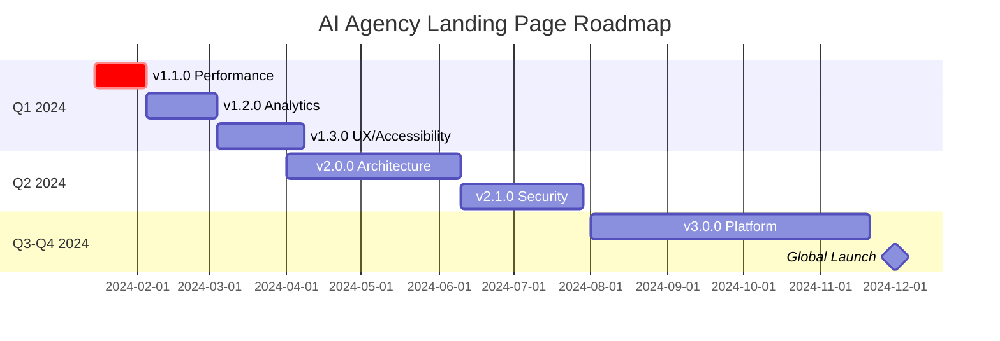

# 🗺️ Roadmap развития проекта AI Agency Landing Page

> Стратегический план развития современной платформы для AI агентства с фокусом на производительность, безопасность и пользовательский опыт

## 📋 Текущий статус (v1.0.0)

### ✅ Реализовано

- [x] **Архитектура**: Next.js 15 + React 19 + TypeScript
- [x] **Аутентификация**: Clerk с многофакторной поддержкой
- [x] **Интернационализация**: 4 языка (UK, EN, PL, DE)
- [x] **UI/UX**: Responsive дизайн с Tailwind CSS + Framer Motion
- [x] **PWA**: Полная поддержка Progressive Web App
- [x] **Тестирование**: Jest + Playwright + Lighthouse CI
- [x] **DevOps**: GitHub Actions CI/CD pipeline
- [x] **Безопасность**: Security headers + мониторинг
- [x] **Качество кода**: ESLint + Prettier + Husky hooks
- [x] **Документация**: Comprehensive README + техническая документация

### 🔧 В процессе оптимизации

- [ ] Bundle size optimization (текущий: ~280KB, цель: <200KB)
- [ ] Test coverage expansion (текущий: 75%, цель: 90%)
- [ ] Performance tuning (текущий Lighthouse: 88, цель: 95+)

## 🎯 Краткосрочные цели (Q1 2024)

### v1.1.0 - Performance & Optimization

**Срок**: 2-3 недели | **Приоритет**: 🔴 Критический

#### 🚀 Основные задачи

**Bundle Optimization**

- [ ] Анализ и устранение дублирующихся зависимостей
- [ ] Внедрение dynamic imports для тяжелых компонентов
- [ ] Tree-shaking оптимизация
- [ ] Code splitting по маршрутам
- **Target**: Bundle size < 200KB gzipped

**Image & Asset Optimization**

- [ ] Автоматическая конвертация в WebP/AVIF
- [ ] Responsive images с Next.js Image
- [ ] Blur placeholder для всех изображений
- [ ] SVG оптимизация и sprite generation
- **Target**: 40% reduction in image payload

**Caching Strategy**

- [ ] Service Worker оптимизация
- [ ] API response caching с SWR
- [ ] Static assets long-term caching
- [ ] Database query optimization
- **Target**: 60% faster repeat visits

#### 📊 Ожидаемые результаты

- **Lighthouse Performance**: 95+ (текущий: 88)
- **First Contentful Paint**: < 1.2s (текущий: 1.8s)
- **Largest Contentful Paint**: < 1.8s (текущий: 2.4s)
- **Time to Interactive**: < 2.0s (текущий: 3.1s)
- **Cumulative Layout Shift**: < 0.05 (текущий: 0.12)

### v1.2.0 - Advanced Analytics & Monitoring

**Срок**: 3-4 недели | **Приоритет**: 🟡 Высокий

#### 📈 Аналитика и мониторинг

**User Analytics Enhancement**

- [ ] Google Analytics 4 с enhanced ecommerce
- [ ] Custom events для user journey mapping
- [ ] Conversion funnel analysis
- [ ] Real-time user behavior tracking
- [ ] Cohort analysis implementation

**Performance Monitoring**

- [ ] Real User Monitoring (RUM) с Web Vitals API
- [ ] Error tracking с Sentry integration
- [ ] Performance metrics dashboard
- [ ] Automated performance alerts
- [ ] Resource timing analysis

**Business Intelligence**

- [ ] A/B testing framework с feature flags
- [ ] Statistical significance calculator
- [ ] Revenue attribution modeling
- [ ] Customer lifetime value tracking
- [ ] Predictive analytics foundation

### v1.3.0 - Enhanced UX & Accessibility

**Срок**: 4-5 недель | **Приоритет**: 🟡 Высокий

#### 🎨 Design System & Accessibility

**Component Library**

- [ ] Comprehensive design system с design tokens
- [ ] Storybook с automated visual testing
- [ ] Figma integration для design handoff
- [ ] Component documentation с usage guidelines
- [ ] Theme customization system

**Accessibility Improvements**

- [ ] WCAG 2.1 AA полное соответствие
- [ ] Screen reader optimization
- [ ] Keyboard navigation enhancement
- [ ] Color contrast improvements (4.5:1 minimum)
- [ ] Focus management для SPA navigation

**Advanced Interactions**

- [ ] Micro-interactions с Framer Motion
- [ ] Gesture support для mobile
- [ ] Voice navigation (experimental)
- [ ] Haptic feedback для PWA
- [ ] Advanced loading states

## 🚀 Среднесрочные цели (Q2 2024)

### v2.0.0 - Architecture Evolution

**Срок**: 8-10 недель | **Приоритет**: 🟠 Средний

#### 🏗️ Архитектурные изменения

**Micro-frontends Architecture**

- [ ] Module federation с Webpack 5
- [ ] Independent team deployments
- [ ] Shared component library
- [ ] Cross-team communication protocols
- [ ] Federated testing strategies

**State Management Evolution**

- [ ] Zustand для client state
- [ ] React Query для server state
- [ ] Optimistic updates implementation
- [ ] Offline-first architecture
- [ ] Real-time synchronization с WebSockets

**API Layer Enhancement**

- [ ] GraphQL federation
- [ ] API versioning strategy
- [ ] Rate limiting с Redis
- [ ] Advanced caching с CDN
- [ ] API documentation с OpenAPI

#### 🤖 AI/ML Integration

**Intelligent Features**

- [ ] Personalized content recommendations
- [ ] Smart search с semantic understanding
- [ ] Automated A/B test optimization
- [ ] Predictive user behavior modeling
- [ ] Content generation assistance

**Chatbot & Support**

- [ ] AI-powered customer support
- [ ] Natural language query processing
- [ ] Multi-language conversation support
- [ ] Integration с CRM systems
- [ ] Sentiment analysis для feedback

### v2.1.0 - Enterprise Security

**Срок**: 6-7 недель | **Приоритет**: 🔴 Критический

#### 🔒 Advanced Security

**Authentication & Authorization**

- [ ] Multi-factor authentication (TOTP, SMS, Hardware keys)
- [ ] Biometric authentication (WebAuthn)
- [ ] Social login expansion (GitHub, LinkedIn, Apple)
- [ ] Role-based access control (RBAC)
- [ ] Session management с JWT refresh tokens

**Security Monitoring**

- [ ] Real-time threat detection
- [ ] Automated security scanning (SAST/DAST)
- [ ] Compliance reporting (SOC 2, GDPR)
- [ ] Incident response automation
- [ ] Security metrics dashboard

**Data Protection**

- [ ] End-to-end encryption
- [ ] Data anonymization tools
- [ ] Audit logging с tamper protection
- [ ] Privacy controls для users
- [ ] Data retention policies

## 🌟 Долгосрочные цели (Q3-Q4 2024)

### v3.0.0 - Platform Transformation

**Срок**: 12-16 недель | **Приоритет**: 🟢 Стратегический

#### 🌐 Global Platform

**Multi-tenant Architecture**

- [ ] White-label solutions для partners
- [ ] Custom branding engine
- [ ] Tenant isolation с shared infrastructure
- [ ] Resource management и billing
- [ ] Multi-region deployment

**Advanced CMS**

- [ ] Headless CMS с Contentful/Strapi
- [ ] Content versioning и workflow
- [ ] Multi-channel publishing
- [ ] Content personalization engine
- [ ] SEO optimization automation

**E-commerce Integration**

- [ ] Payment processing (Stripe, PayPal)
- [ ] Subscription management
- [ ] Invoice generation и accounting
- [ ] Tax calculation для multiple regions
- [ ] Revenue optimization tools

#### 🚀 Next-Gen Features

**Edge Computing**

- [ ] Edge functions для personalization
- [ ] Global CDN с intelligent routing
- [ ] Regional data processing
- [ ] Latency optimization < 100ms globally
- [ ] Edge-side rendering (ESR)

**Advanced PWA**

- [ ] Background sync для offline actions
- [ ] Push notifications с segmentation
- [ ] App store distribution
- [ ] Native app features (camera, contacts)
- [ ] Cross-platform synchronization

## 📊 Ключевые метрики успеха

### 🎯 Технические KPI

| Метрика                | Текущее | v1.3  | v2.1  | v3.0  |
| ---------------------- | ------- | ----- | ----- | ----- |
| Lighthouse Performance | 88      | 95+   | 98+   | 99+   |
| Bundle Size (gzipped)  | 280KB   | 200KB | 150KB | 120KB |
| First Contentful Paint | 1.8s    | 1.2s  | 0.8s  | 0.6s  |
| Time to Interactive    | 3.1s    | 2.0s  | 1.5s  | 1.0s  |
| Test Coverage          | 75%     | 85%   | 90%   | 95%   |
| Security Score         | B+      | A     | A+    | A+    |

### 📈 Бизнес KPI

| Метрика           | Текущее | Цель Q2 | Цель Q4 |
| ----------------- | ------- | ------- | ------- |
| Page Load Time    | 2.4s    | 1.5s    | 1.0s    |
| Bounce Rate       | 45%     | 30%     | 20%     |
| Conversion Rate   | 2.1%    | 4.0%    | 6.0%    |
| Mobile Traffic    | 55%     | 65%     | 75%     |
| Return Visitors   | 25%     | 40%     | 55%     |
| User Satisfaction | 4.1/5   | 4.5/5   | 4.8/5   |

### 🔧 Качество кода

| Метрика                  | Текущее      | Цель          |
| ------------------------ | ------------ | ------------- |
| Code Quality (SonarQube) | B+           | A             |
| Technical Debt           | 8%           | <3%           |
| Bug Density              | 2.1/1000 LOC | <0.5/1000 LOC |
| Code Review Coverage     | 85%          | 100%          |
| Documentation Coverage   | 60%          | 90%           |

## 🛠️ Технологический стек (эволюция)

### 📅 Текущий стек (v1.0)

```yaml
Frontend:
  - Next.js 15.0
  - React 19.0
  - TypeScript 5.3
  - Tailwind CSS 3.4
  - Framer Motion 10.0

Authentication:
  - Clerk

Testing:
  - Jest 29.0
  - Playwright 1.40
  - Testing Library

DevOps:
  - GitHub Actions
  - Vercel
  - Lighthouse CI
```

### 🔮 Планируемый стек (v3.0)

```yaml
Frontend:
  - Next.js 16+ (Turbopack)
  - React 19+ (Server Components)
  - TypeScript 5.5+
  - Tailwind CSS 4.0
  - Framer Motion 11+

State Management:
  - Zustand 4.0
  - React Query 5.0
  - Jotai (atomic state)

Testing:
  - Vitest (faster than Jest)
  - Playwright 2.0
  - Storybook 8.0
  - Chromatic (visual testing)

Build & Deploy:
  - Turbopack
  - Docker + Kubernetes
  - Vercel Edge Functions
  - CloudFlare Workers

Monitoring:
  - Datadog
  - Sentry
  - LogRocket
  - Mixpanel
```

## 🎯 Приоритизация задач

### 🔴 Критический приоритет

1. **Performance Optimization** - Прямое влияние на UX и SEO
2. **Security Enhancements** - Защита пользователей и данных
3. **Mobile Experience** - 60%+ трафика с мобильных
4. **Core Web Vitals** - Google ranking factor

### 🟡 Высокий приоритет

1. **Accessibility Compliance** - Инклюзивность и legal compliance
2. **Analytics & Monitoring** - Data-driven decisions
3. **Test Coverage** - Качество и стабильность
4. **Documentation** - Team efficiency

### 🟠 Средний приоритет

1. **A/B Testing Framework** - Conversion optimization
2. **Internationalization** - Global market expansion
3. **Advanced Features** - Competitive advantage
4. **Developer Experience** - Team productivity

### 🟢 Низкий приоритет

1. **Experimental Features** - Innovation и R&D
2. **Third-party Integrations** - Ecosystem expansion
3. **Advanced Analytics** - Deep insights
4. **Automation Tools** - Long-term efficiency

## 📅 Детальный Timeline



## 🤝 Команда и процессы

### 👥 Роли и ответственности

**Core Team**

- **Tech Lead** (1) - Архитектурные решения, code review
- **Senior Frontend** (2) - Feature development, mentoring
- **Frontend Developer** (2) - Implementation, testing
- **QA Engineer** (1) - Testing strategy, automation
- **DevOps Engineer** (1) - Infrastructure, CI/CD
- **UX/UI Designer** (1) - User experience, design system

**Extended Team**

- **Product Manager** (1) - Roadmap, priorities
- **Security Specialist** (0.5) - Security review, compliance
- **Performance Engineer** (0.5) - Optimization, monitoring

### 🔄 Процессы разработки

**Sprint Planning** (Bi-weekly)

- Story estimation с Planning Poker
- Capacity planning
- Risk assessment
- Dependencies mapping

**Quality Gates**

- **Code Review** - Mandatory для всех PR
- **Architecture Review** - Для изменений >500 LOC
- **Security Review** - Для security-related changes
- **Performance Review** - Для UI/UX changes

**Continuous Integration**

- Automated testing на каждый commit
- Performance budgets enforcement
- Security scanning
- Accessibility testing

## 📈 Мониторинг и отчетность

### 📊 Dashboard метрик

**Real-time Monitoring**

- Performance metrics (Core Web Vitals)
- Error rates и crash reports
- User engagement metrics
- Business conversion metrics

**Weekly Reports**

- Sprint velocity и burndown
- Code quality metrics
- Test coverage trends
- Security vulnerability status

**Monthly Reviews**

- Roadmap progress assessment
- Technical debt analysis
- User feedback summary
- Performance benchmarking

**Quarterly Planning**

- OKR review и planning
- Technology stack evaluation
- Team capacity planning
- Market analysis и competitive research

## 🎯 Критерии успеха

### ✅ Definition of Done

**Feature Completion**

- [ ] Functional requirements met
- [ ] Non-functional requirements met
- [ ] Unit tests written (>80% coverage)
- [ ] Integration tests passed
- [ ] Performance benchmarks met
- [ ] Security review completed
- [ ] Accessibility compliance verified
- [ ] Documentation updated
- [ ] Code review approved
- [ ] QA testing completed

**Release Readiness**

- [ ] All tests passing
- [ ] Performance budget met
- [ ] Security scan clean
- [ ] Accessibility audit passed
- [ ] Browser compatibility verified
- [ ] Mobile responsiveness confirmed
- [ ] Analytics tracking implemented
- [ ] Error monitoring configured
- [ ] Rollback plan prepared
- [ ] Stakeholder approval received

## 🔄 Адаптация и обновления

### 📝 Процесс обновления Roadmap

**Monthly Reviews**

- Progress assessment
- Priority adjustments
- Resource reallocation
- Timeline updates

**Quarterly Planning**

- Strategic direction review
- Market analysis integration
- Technology trend evaluation
- Team feedback incorporation

**Continuous Feedback**

- User feedback integration
- Performance data analysis
- Business metrics review
- Technical debt assessment

---

<div align="center">
  <h3>🚀 Этот roadmap - живой документ, который эволюционирует вместе с проектом</h3>
  <p><strong>Последнее обновление:</strong> Январь 2024</p>
  <p><strong>Следующий review:</strong> Февраль 2024</p>
  <p><em>"Успех - это путешествие, а не пункт назначения"</em></p>
</div>
