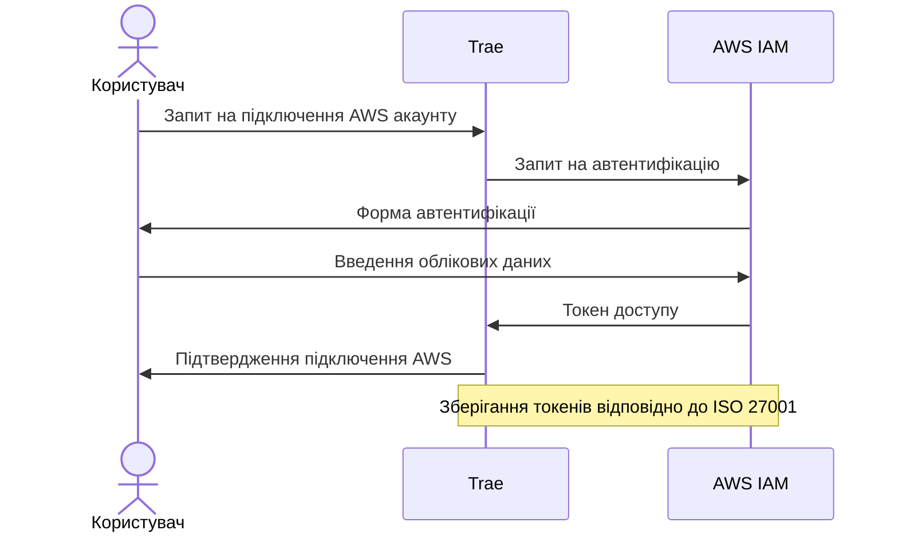
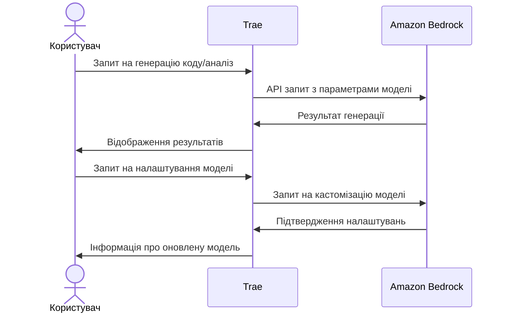
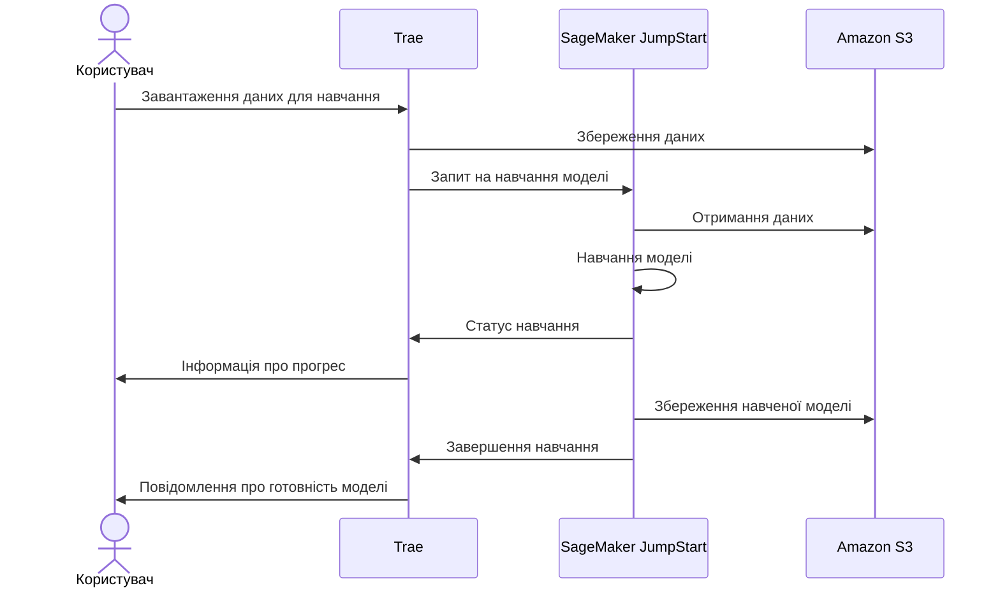
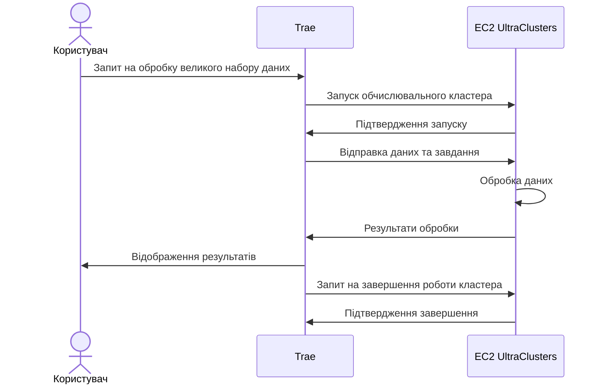
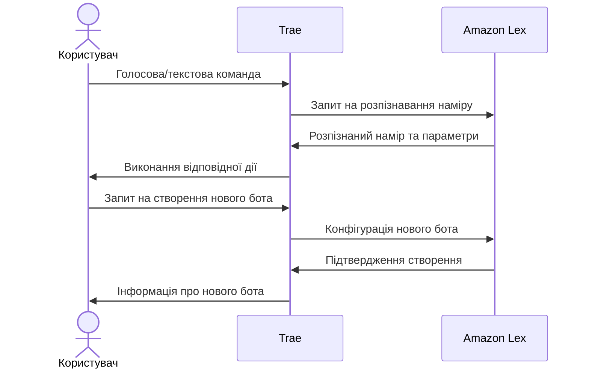
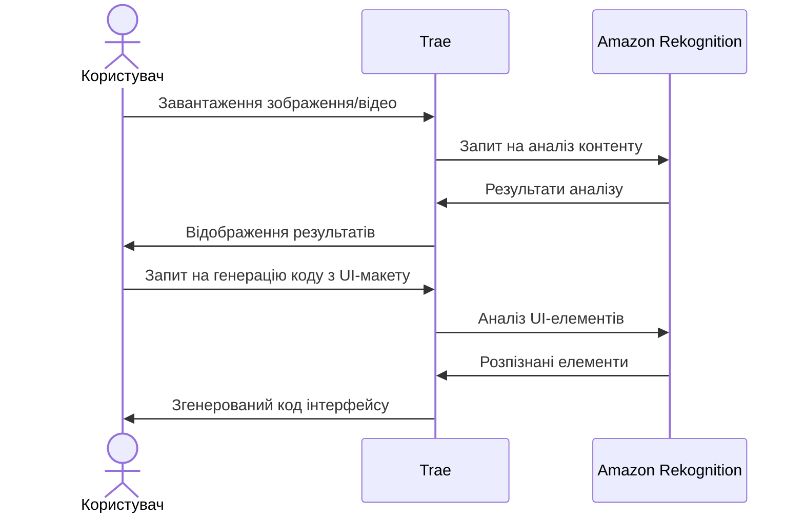
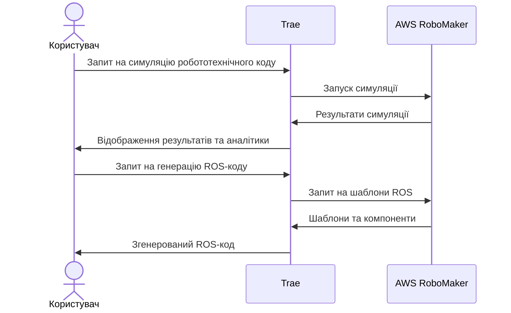
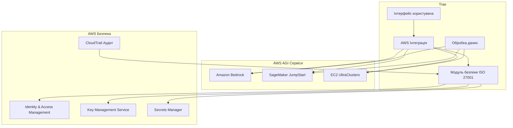

# Інтеграція Trae з AWS AGI сервісами

Цей документ описує інтеграцію системи Trae з сервісами штучного інтелекту AWS, включаючи Amazon Bedrock, SageMaker JumpStart, EC2 UltraClusters, Amazon Lex, Amazon Rekognition та AWS RoboMaker, з дотриманням вимог ISO 27001.

## Що таке AGI (Artificial General Intelligence)

Штучний загальний інтелект (AGI) - це галузь теоретичних досліджень ШІ, яка намагається створити програмне забезпечення з людиноподібним інтелектом та здатністю до самонавчання. Мета полягає в тому, щоб програмне забезпечення могло виконувати завдання, для яких воно не обов'язково навчене або розроблене.

На відміну від вузькоспеціалізованого ШІ, система AGI може вирішувати проблеми в різних доменах, як людина, без ручного втручання. Замість того, щоб обмежуватися конкретною сферою, AGI може самонавчатися та вирішувати проблеми, для яких вона ніколи не була навчена. AGI є теоретичним представленням повного штучного інтелекту, який вирішує складні завдання з узагальненими когнітивними здібностями людини.

Amazon активно розвиває напрямок AGI через підрозділ Amazon Artificial General Intelligence (AGI), який працює над новим поколінням моделей Amazon Nova та розробляє фундаментальні можливості для створення корисних ШІ-агентів, здатних виконувати дії в цифровому та фізичному світах.

## Огляд AWS AGI сервісів

### Amazon Bedrock

Повністю керований сервіс, що надає доступ до моделей генеративного ШІ через API. Дозволяє вибирати, налаштовувати, навчати та розгортати базові моделі для роботи з власними даними.

### Amazon SageMaker JumpStart

Допомагає командам розробників прискорити розробку ШІ, створюючи, навчаючи та розгортаючи базові моделі в центрі машинного навчання.

### Amazon EC2 UltraClusters

Кластери Еластичного хмарного обчислення для підтримки робочих навантажень генеративного ШІ з використанням суперкомп'ютерних графічних процесорів для обробки великих наборів даних з низькою затримкою.

### Amazon Lex

Сервіс для створення чат-ботів з діалоговим ШІ, що використовує ту ж технологію, що й Alexa. Amazon Lex дозволяє створювати та розгортати інтерфейси розмовного ШІ для будь-якого додатку. Користувачі можуть взаємодіяти з додатками за допомогою природної мови голосом або текстом. Lex інтегрується з Amazon Connect для створення розмовних ботів, які обробляють запити клієнтів через різні канали, включаючи чат або телефон.

### Amazon Rekognition

Сервіс комп'ютерного зору, що використовує машинне навчання для автоматизації та зниження вартості розпізнавання зображень та аналізу відео. Rekognition дозволяє швидко та точно ідентифікувати небезпечний або неприйнятний вміст у зображеннях та відео на основі загальних або специфічних для бізнесу стандартів. Сервіс включає Rekognition Image для виявлення об'єктів та сцен на зображеннях, та Rekognition Video для виявлення руху об'єктів у кадрі.

### AWS RoboMaker

Хмарний сервіс симуляції, який дозволяє розробникам робототехніки запускати, масштабувати та автоматизувати симуляцію без управління інфраструктурою. RoboMaker включає хмарні розширення для ROS (Robot Operating System), такі як Amazon Kinesis Video Streams для потокового відео, Amazon Rekognition для аналізу зображень та відео, Amazon Lex для розпізнавання мови, Amazon Polly для генерації мови та Amazon CloudWatch для логування та моніторингу.

### Amazon Nova

Нове покоління базових моделей від Amazon, що забезпечують передовий інтелект та провідне співвідношення ціни та продуктивності. Включає Amazon Nova Creative Content Generation Model - сучасну модель для генерації зображень та відео.

## Інтеграція з акаунтом AWS

### Автентифікація та авторизація



### Управління ключами та секретами

- Використання AWS Key Management Service (KMS) для шифрування ключів API
- Зберігання секретів у AWS Secrets Manager
- Ротація ключів згідно з політиками безпеки ISO 27001
- Аудит доступу до ключів та секретів

## Алгоритми взаємодії з AWS AGI сервісами

### Інтеграція з Amazon Bedrock



### Інтеграція з SageMaker JumpStart



### Використання EC2 UltraClusters



### Інтеграція з Amazon Lex



### Інтеграція з Amazon Rekognition



### Інтеграція з AWS RoboMaker



## Відповідність ISO 27001

### Політики безпеки

- Шифрування даних у спокої та під час передачі
- Багатофакторна автентифікація для доступу до AWS ресурсів
- Мінімальні привілеї для сервісних ролей
- Регулярний аудит безпеки та оцінка ризиків

### Управління інцидентами

- Моніторинг безпеки з використанням AWS CloudTrail та CloudWatch
- Процедури реагування на інциденти
- Регулярне тестування процедур відновлення

### Безперервність бізнесу

- Резервне копіювання конфігурацій та даних
- Стратегія відновлення після збоїв
- Тестування планів аварійного відновлення

## Архітектура інтеграції



## Налаштування та конфігурація

### Початкова конфігурація

1. Створення AWS акаунту
2. Налаштування IAM ролей та політик
3. Конфігурація VPC та груп безпеки
4. Налаштування AWS KMS ключів
5. Конфігурація AWS CloudTrail для аудиту

### Інтеграція з Trae

1. Встановлення AWS SDK
2. Конфігурація параметрів підключення
3. Налаштування обробників подій
4. Тестування підключення та безпеки

## Рекомендації з використання

### Оптимізація витрат

- Використання AWS Auto Scaling для EC2 UltraClusters
- Моніторинг використання ресурсів
- Встановлення бюджетів та сповіщень
- Використання Amazon Lex та Rekognition з оптимізованими параметрами для зменшення витрат
- Застосування кешування результатів розпізнавання для повторюваних запитів

### Продуктивність

- Кешування результатів запитів до моделей
- Оптимізація параметрів моделей
- Використання AWS CloudFront для розподілу навантаження
- Використання паралельної обробки для аналізу зображень з Rekognition
- Оптимізація розміру та якості зображень перед відправкою на аналіз

### Масштабування

- Архітектура для горизонтального масштабування
- Використання AWS Elastic Load Balancing
- Стратегії для обробки пікових навантажень
- Застосування мікросервісної архітектури для інтеграції з різними AWS AGI сервісами
- Використання AWS Lambda для безсерверної обробки запитів до AGI сервісів

## Приклади використання

## Приклади коду

### Генерація коду з Amazon Bedrock

```javascript
// aws-integration.js
const { BedrockRuntimeClient, InvokeModelCommand } = require('@aws-sdk/client-bedrock-runtime');

async function generateCodeWithBedrock(prompt) {
  const client = new BedrockRuntimeClient({ region: 'us-west-2' });

  const payload = {
    prompt: `Generate code for: ${prompt}`,
    max_tokens_to_sample: 2000,
    temperature: 0.7,
    top_p: 0.9,
  };

  const command = new InvokeModelCommand({
    modelId: 'anthropic.claude-v2',
    contentType: 'application/json',
    accept: 'application/json',
    body: JSON.stringify(payload),
  });

  try {
    const response = await client.send(command);
    const result = JSON.parse(new TextDecoder().decode(response.body));
    return result.completion;
  } catch (error) {
    console.error('Error generating code:', error);
    throw error;
  }
}

module.exports = { generateCodeWithBedrock };
```

### Навчання моделі з SageMaker JumpStart

```python
# sagemaker_training.py
import boto3
import sagemaker
import time
from sagemaker.jumpstart.model import JumpStartModel

def train_custom_model(training_data_s3_uri, model_id, hyperparameters):
    role = sagemaker.get_execution_role()

    # Ініціалізація моделі JumpStart
    model = JumpStartModel(model_id=model_id)

    # Налаштування гіперпараметрів
    model.set_hyperparameters(**hyperparameters)

    # Навчання моделі
    training_job_name = f"trae-custom-model-{int(time.time())}"

    model.fit(
        training_data=training_data_s3_uri,
        job_name=training_job_name,
        logs=True
    )

    # Отримання URI навченої моделі
    trained_model_uri = model.model_data

    return {
        "training_job_name": training_job_name,
        "model_uri": trained_model_uri
    }
```

### Інтеграція з Amazon Lex

```javascript
// lex-integration.js
const {
  LexRuntimeV2Client,
  RecognizeTextCommand,
  RecognizeUtteranceCommand,
} = require('@aws-sdk/client-lex-runtime-v2');

async function processUserInput(botId, botAliasId, localeId, sessionId, text) {
  const client = new LexRuntimeV2Client({ region: 'us-east-1' });

  const params = {
    botId,
    botAliasId,
    localeId,
    sessionId,
    text,
  };

  try {
    const command = new RecognizeTextCommand(params);
    const response = await client.send(command);

    // Обробка відповіді від Lex
    const intent = response.interpretations[0]?.intent?.name || 'Unknown';
    const slots = response.interpretations[0]?.intent?.slots || {};

    // Виконання дій на основі наміру
    return {
      intent,
      slots,
      messages: response.messages,
      sessionState: response.sessionState,
    };
  } catch (error) {
    console.error('Error processing user input with Lex:', error);
    throw error;
  }
}

async function processVoiceInput(botId, botAliasId, localeId, sessionId, audioBlob) {
  const client = new LexRuntimeV2Client({ region: 'us-east-1' });

  const params = {
    botId,
    botAliasId,
    localeId,
    sessionId,
    requestContentType: 'audio/x-l16; sample-rate=16000; channel-count=1',
    responseContentType: 'audio/mpeg',
    inputStream: audioBlob,
  };

  try {
    const command = new RecognizeUtteranceCommand(params);
    const response = await client.send(command);

    return {
      audioResponse: response.audioStream,
      contentType: response.contentType,
      messages: JSON.parse(response.messages),
      sessionState: JSON.parse(response.sessionState),
      inputTranscript: response.inputTranscript,
    };
  } catch (error) {
    console.error('Error processing voice input with Lex:', error);
    throw error;
  }
}

module.exports = { processUserInput, processVoiceInput };
```

### Інтеграція з Amazon Rekognition

```javascript
// rekognition-integration.js
const {
  RekognitionClient,
  DetectLabelsCommand,
  DetectTextCommand,
  AnalyzeDocumentCommand,
} = require('@aws-sdk/client-rekognition');

async function analyzeUIScreenshot(imageBuffer) {
  const client = new RekognitionClient({ region: 'us-east-1' });

  // Виявлення елементів UI на скріншоті
  const detectLabelsParams = {
    Image: { Bytes: imageBuffer },
    MaxLabels: 50,
    MinConfidence: 70,
  };

  // Виявлення тексту на скріншоті
  const detectTextParams = {
    Image: { Bytes: imageBuffer },
  };

  try {
    const [labelsResponse, textResponse] = await Promise.all([
      client.send(new DetectLabelsCommand(detectLabelsParams)),
      client.send(new DetectTextCommand(detectTextParams)),
    ]);

    // Аналіз виявлених елементів для генерації коду
    const uiElements = labelsResponse.Labels.map(label => ({
      name: label.Name,
      confidence: label.Confidence,
      boundingBox: label.Instances.length > 0 ? label.Instances[0].BoundingBox : null,
    }));

    const textElements = textResponse.TextDetections.filter(text => text.Type === 'LINE').map(
      text => ({
        content: text.DetectedText,
        confidence: text.Confidence,
        boundingBox: text.Geometry.BoundingBox,
      })
    );

    return {
      uiElements,
      textElements,
    };
  } catch (error) {
    console.error('Error analyzing UI screenshot:', error);
    throw error;
  }
}

async function analyzeDiagram(imageBuffer) {
  const client = new RekognitionClient({ region: 'us-east-1' });

  const params = {
    Document: {
      Bytes: imageBuffer,
    },
    FeatureTypes: ['TABLES', 'FORMS'],
  };

  try {
    const command = new AnalyzeDocumentCommand(params);
    const response = await client.send(command);

    // Обробка результатів аналізу діаграми
    return {
      blocks: response.Blocks,
      tables: response.Tables,
      forms: response.Forms,
    };
  } catch (error) {
    console.error('Error analyzing diagram:', error);
    throw error;
  }
}

module.exports = { analyzeUIScreenshot, analyzeDiagram };
```

### Інтеграція з AWS RoboMaker

```python
# robomaker_integration.py
import boto3
import json
import time

def create_simulation_job(robot_app_arn, simulation_app_arn, output_location, iam_role):
    client = boto3.client('robomaker')

    response = client.create_simulation_job(
        maxJobDurationInSeconds=3600,
        iamRole=iam_role,
        robotApplications=[
            {
                'application': robot_app_arn,
                'applicationVersion': '$LATEST',
                'launchConfig': {
                    'packageName': 'robot_app_package',
                    'launchFile': 'launch_simulation.launch'
                }
            }
        ],
        simulationApplications=[
            {
                'application': simulation_app_arn,
                'applicationVersion': '$LATEST',
                'launchConfig': {
                    'packageName': 'simulation_app_package',
                    'launchFile': 'launch_simulation.launch'
                }
            }
        ],
        dataSources=[
            {
                'name': 'RoboMakerSimulationLogs',
                'destination': f"{output_location}/logs",
                'type': 'LOG'
            },
            {
                'name': 'RoboMakerSimulationData',
                'destination': f"{output_location}/data",
                'type': 'UPLOAD'
            }
        ],
        outputLocation={
            's3Bucket': output_location.split('/')[2],
            's3Prefix': '/'.join(output_location.split('/')[3:])
        }
    )

    return response['arn']

def generate_ros_code(template_type, parameters):
    # Генерація коду ROS на основі шаблонів
    templates = {
        'node': '''#!/usr/bin/env python
import rospy

def main():
    rospy.init_node('{node_name}')
    rate = rospy.Rate({rate})

    while not rospy.is_shutdown():
        # {node_purpose}
        rate.sleep()

if __name__ == '__main__':
    try:
        main()
    except rospy.ROSInterruptException:
        pass''',

        'publisher': '''#!/usr/bin/env python
import rospy
from {msg_package}.msg import {msg_type}

def main():
    rospy.init_node('{node_name}')
    pub = rospy.Publisher('{topic_name}', {msg_type}, queue_size={queue_size})
    rate = rospy.Rate({rate})

    while not rospy.is_shutdown():
        # Create message
        msg = {msg_type}()
        # {publisher_purpose}

        pub.publish(msg)
        rate.sleep()

if __name__ == '__main__':
    try:
        main()
    except rospy.ROSInterruptException:
        pass''',

        'subscriber': '''#!/usr/bin/env python
import rospy
from {msg_package}.msg import {msg_type}

def callback(msg):
    # {subscriber_purpose}
    rospy.loginfo("Received message: %s", msg)

def main():
    rospy.init_node('{node_name}')
    rospy.Subscriber('{topic_name}', {msg_type}, callback)

    rospy.spin()

if __name__ == '__main__':
    main()'''
    }

    if template_type in templates:
        return templates[template_type].format(**parameters)
    else:
        raise ValueError(f"Unknown template type: {template_type}")
```

### Інтеграція з Amazon Nova

```javascript
// nova-integration.js
const { BedrockRuntimeClient, InvokeModelCommand } = require('@aws-sdk/client-bedrock-runtime');

async function generateUIWithNova(description) {
  const client = new BedrockRuntimeClient({ region: 'us-west-2' });

  const payload = {
    prompt: `Generate UI design based on this description: ${description}`,
    max_tokens_to_sample: 4000,
    temperature: 0.8,
    top_p: 0.9,
    return_image: true,
  };

  const command = new InvokeModelCommand({
    modelId: 'amazon.nova-1', // Використання моделі Amazon Nova
    contentType: 'application/json',
    accept: 'application/json',
    body: JSON.stringify(payload),
  });

  try {
    const response = await client.send(command);
    const result = JSON.parse(new TextDecoder().decode(response.body));

    return {
      imageData: result.image,
      htmlCode: result.html_code,
      cssCode: result.css_code,
      description: result.description,
    };
  } catch (error) {
    console.error('Error generating UI with Nova:', error);
    throw error;
  }
}

async function generateCodeWithNova(prompt, codeContext) {
  const client = new BedrockRuntimeClient({ region: 'us-west-2' });

  const payload = {
    prompt: prompt,
    context: codeContext,
    max_tokens_to_sample: 8000,
    temperature: 0.5,
    top_p: 0.9,
  };

  const command = new InvokeModelCommand({
    modelId: 'amazon.nova-1',
    contentType: 'application/json',
    accept: 'application/json',
    body: JSON.stringify(payload),
  });

  try {
    const response = await client.send(command);
    const result = JSON.parse(new TextDecoder().decode(response.body));

    return {
      code: result.code,
      explanation: result.explanation,
      suggestions: result.suggestions,
    };
  } catch (error) {
    console.error('Error generating code with Nova:', error);
    throw error;
  }
}

module.exports = { generateUIWithNova, generateCodeWithNova };
```

```

## Висновки

Інтеграція Trae з AWS AGI сервісами надає потужні можливості для розробки, навчання та розгортання моделей штучного інтелекту, дотримуючись стандартів безпеки ISO 27001. Ця інтеграція дозволяє користувачам Trae використовувати передові технології AWS для генеративного ШІ, аналізу коду та обробки великих обсягів даних, забезпечуючи при цьому безпеку та відповідність нормативним вимогам.
```
