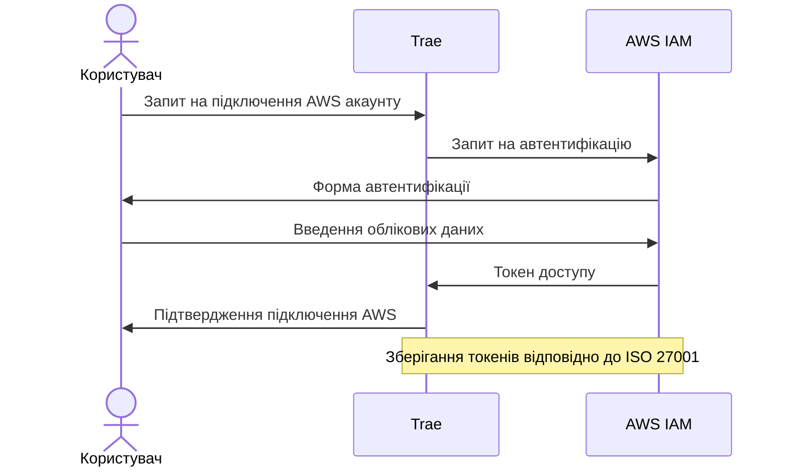
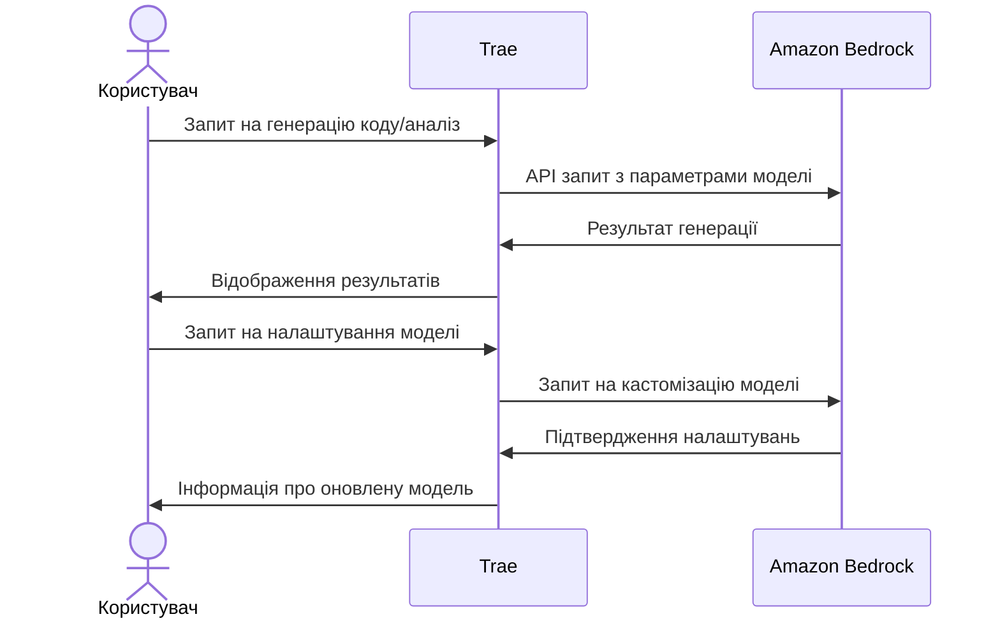
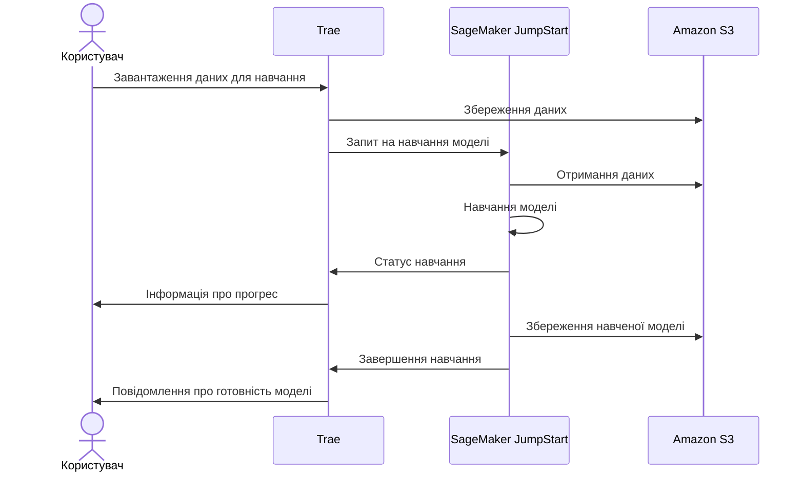
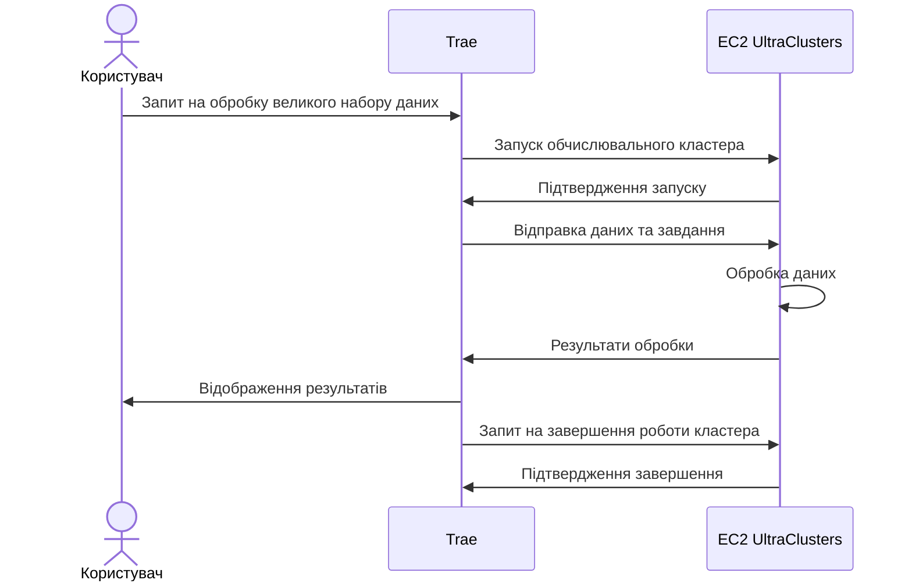
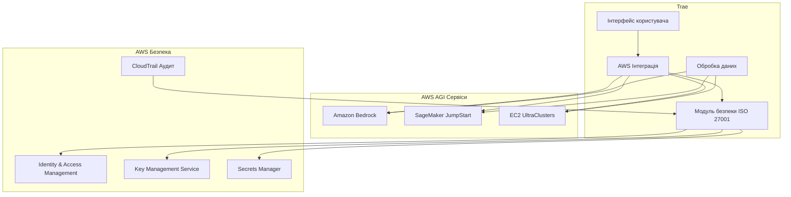

# Інтеграція Trae з AWS AGI сервісами

Цей документ описує інтеграцію системи Trae з сервісами штучного інтелекту AWS, включаючи Amazon Bedrock, SageMaker JumpStart та EC2 UltraClusters, з дотриманням вимог ISO 27001.

## Огляд AWS AGI сервісів

### Amazon Bedrock
Повністю керований сервіс, що надає доступ до моделей генеративного ШІ через API. Дозволяє вибирати, налаштовувати, навчати та розгортати базові моделі для роботи з власними даними.

### Amazon SageMaker JumpStart
Допомагає командам розробників прискорити розробку ШІ, створюючи, навчаючи та розгортаючи базові моделі в центрі машинного навчання.

### Amazon EC2 UltraClusters
Кластери Еластичного хмарного обчислення для підтримки робочих навантажень генеративного ШІ з використанням суперкомп'ютерних графічних процесорів для обробки великих наборів даних з низькою затримкою.

## Інтеграція з акаунтом AWS

### Автентифікація та авторизація



### Управління ключами та секретами

- Використання AWS Key Management Service (KMS) для шифрування ключів API
- Зберігання секретів у AWS Secrets Manager
- Ротація ключів згідно з політиками безпеки ISO 27001
- Аудит доступу до ключів та секретів

## Алгоритми взаємодії з AWS AGI сервісами

### Інтеграція з Amazon Bedrock



### Інтеграція з SageMaker JumpStart



### Використання EC2 UltraClusters



## Відповідність ISO 27001

### Політики безпеки

- Шифрування даних у спокої та під час передачі
- Багатофакторна автентифікація для доступу до AWS ресурсів
- Мінімальні привілеї для сервісних ролей
- Регулярний аудит безпеки та оцінка ризиків

### Управління інцидентами

- Моніторинг безпеки з використанням AWS CloudTrail та CloudWatch
- Процедури реагування на інциденти
- Регулярне тестування процедур відновлення

### Безперервність бізнесу

- Резервне копіювання конфігурацій та даних
- Стратегія відновлення після збоїв
- Тестування планів аварійного відновлення

## Архітектура інтеграції



## Налаштування та конфігурація

### Початкова конфігурація

1. Створення AWS акаунту
2. Налаштування IAM ролей та політик
3. Конфігурація VPC та груп безпеки
4. Налаштування AWS KMS ключів
5. Конфігурація AWS CloudTrail для аудиту

### Інтеграція з Trae

1. Встановлення AWS SDK
2. Конфігурація параметрів підключення
3. Налаштування обробників подій
4. Тестування підключення та безпеки

## Рекомендації з використання

### Оптимізація витрат

- Використання AWS Auto Scaling для EC2 UltraClusters
- Моніторинг використання ресурсів
- Встановлення бюджетів та сповіщень

### Продуктивність

- Кешування результатів запитів до моделей
- Оптимізація параметрів моделей
- Використання AWS CloudFront для розподілу навантаження

### Масштабування

- Архітектура для горизонтального масштабування
- Використання AWS Elastic Load Balancing
- Стратегії для обробки пікових навантажень

## Приклади використання

### Генерація коду з Amazon Bedrock

```javascript
// Приклад інтеграції з Amazon Bedrock API
async function generateCode(prompt, parameters) {
  const bedrockRuntime = new AWS.BedrockRuntime();
  
  const response = await bedrockRuntime.invokeModel({
    modelId: 'amazon.titan-code-generator',
    contentType: 'application/json',
    accept: 'application/json',
    body: JSON.stringify({
      prompt: prompt,
      max_tokens: parameters.maxTokens,
      temperature: parameters.temperature
    })
  }).promise();
  
  return JSON.parse(response.body.toString());
}
```

### Навчання моделі з SageMaker JumpStart

```javascript
// Приклад інтеграції з SageMaker JumpStart
async function trainModel(datasetS3Uri, hyperparameters) {
  const sageMaker = new AWS.SageMaker();
  
  const trainingJob = await sageMaker.createTrainingJob({
    TrainingJobName: `trae-model-${Date.now()}`,
    AlgorithmSpecification: {
      TrainingImage: 'jumpstart-model-uri',
      TrainingInputMode: 'File'
    },
    RoleArn: 'arn:aws:iam::account-id:role/service-role/AmazonSageMaker-ExecutionRole',
    InputDataConfig: [{
      ChannelName: 'training',
      DataSource: {
        S3DataSource: {
          S3DataType: 'S3Prefix',
          S3Uri: datasetS3Uri
        }
      }
    }],
    OutputDataConfig: {
      S3OutputPath: 's3://bucket-name/output'
    },
    ResourceConfig: {
      InstanceType: 'ml.p3.2xlarge',
      InstanceCount: 1,
      VolumeSizeInGB: 50
    },
    HyperParameters: hyperparameters,
    StoppingCondition: {
      MaxRuntimeInSeconds: 86400
    }
  }).promise();
  
  return trainingJob;
}
```

## Висновки

Інтеграція Trae з AWS AGI сервісами надає потужні можливості для розробки, навчання та розгортання моделей штучного інтелекту, дотримуючись стандартів безпеки ISO 27001. Ця інтеграція дозволяє користувачам Trae використовувати передові технології AWS для генеративного ШІ, аналізу коду та обробки великих обсягів даних, забезпечуючи при цьому безпеку та відповідність нормативним вимогам.