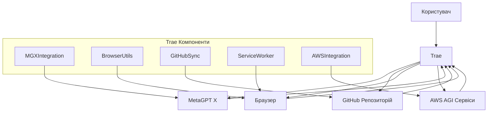
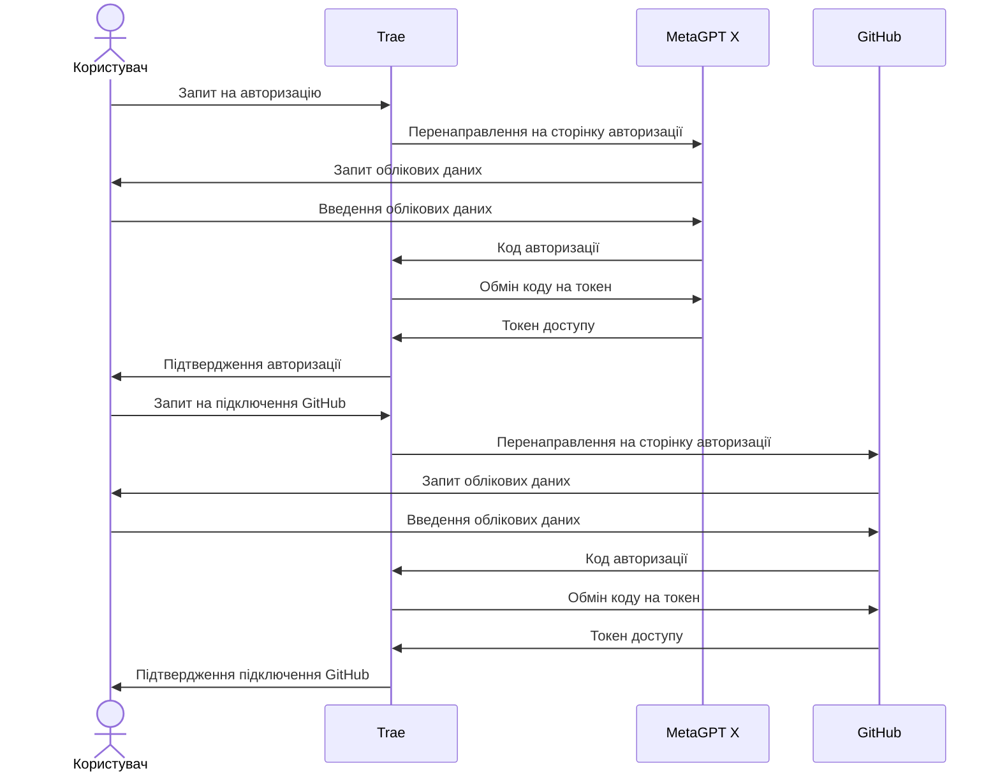
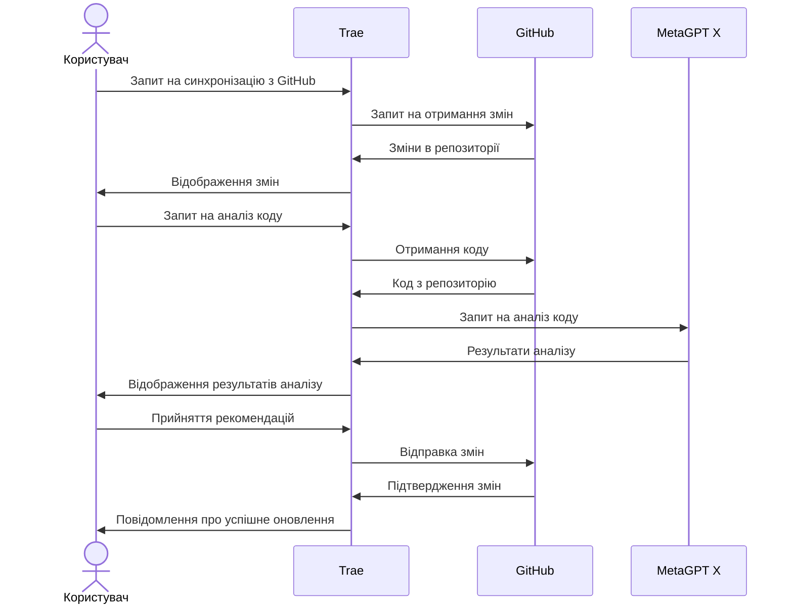
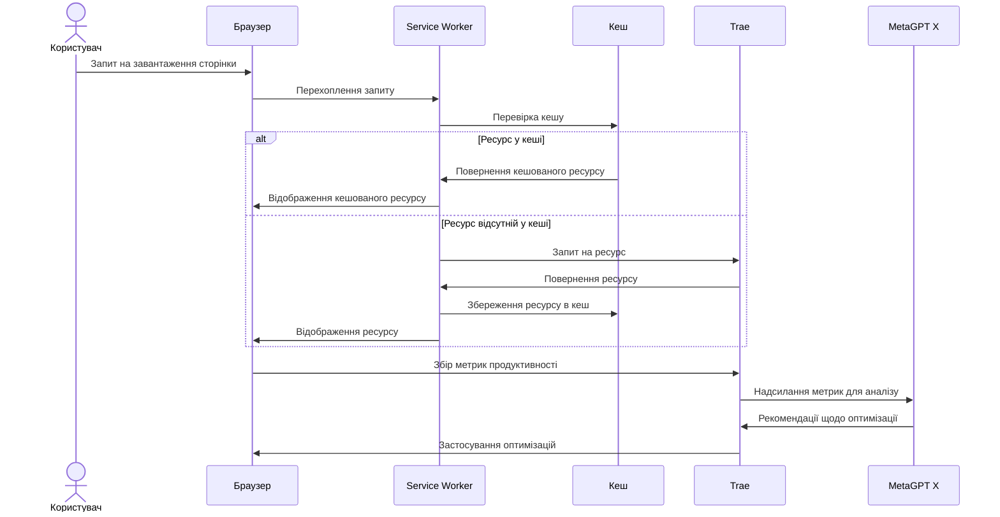
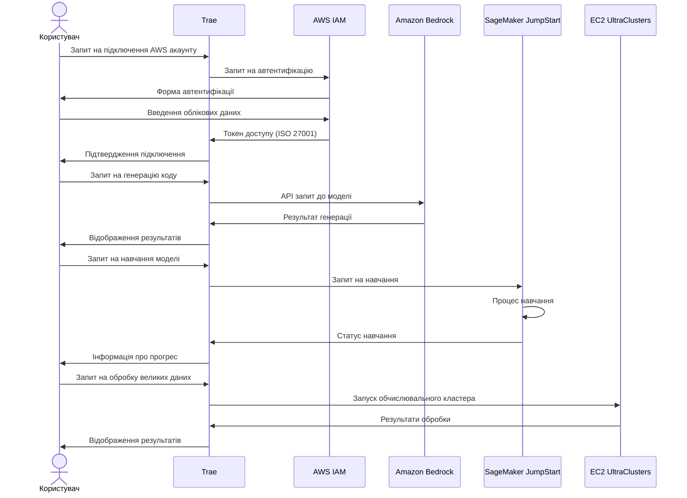

# Діаграма взаємодії між Trae, GitHub, MGX, AWS AGI та браузером

## Загальна архітектура системи

Цей документ містить діаграми, які візуалізують взаємодію між компонентами системи: Trae, GitHub, MGX, AWS AGI сервісами та браузером.

## Діаграма потоку даних

## Діаграма послідовності авторизації

## Діаграма компонентів системи

```mermaid
graph TB
    subgraph "Trae"
        UI[Інтерфейс користувача]
        MGXIntegration[MGX Інтеграція]
        GitHubIntegration[GitHub Інтеграція]
        BrowserOptimization[Оптимізація браузера]
        LocalizationSystem[Система локалізації]
        AWSIntegration[AWS AGI Інтеграція]
        SecurityModule[Модуль безпеки ISO 27001]
    end

    subgraph "MGX"
        MGX_API[MGX API]
        MGX_Auth[MGX Авторизація]
        MGX_Analysis[MGX Аналіз коду]
    end

    subgraph "GitHub"
        GitHub_API[GitHub API]
        GitHub_Auth[GitHub Авторизація]
        GitHub_Repo[GitHub Репозиторій]
    end

    subgraph "Браузер"
        ServiceWorker[Service Worker]
        Cache[Кеш]
        PWA[PWA Функціональність]
    end

    subgraph "AWS AGI"
        Bedrock[Amazon Bedrock]
        SageMaker[SageMaker JumpStart]
        EC2Ultra[EC2 UltraClusters]
        AWS_Security[AWS IAM & Security]
    end

    UI --> MGXIntegration
    UI --> GitHubIntegration
    UI --> BrowserOptimization
    UI --> LocalizationSystem
    UI --> AWSIntegration

    MGXIntegration --> MGX_API
    MGXIntegration --> MGX_Auth
    MGXIntegration --> MGX_Analysis

    GitHubIntegration --> GitHub_API
    GitHubIntegration --> GitHub_Auth
    GitHubIntegration --> GitHub_Repo

    BrowserOptimization --> ServiceWorker
    BrowserOptimization --> Cache
    BrowserOptimization --> PWA

    AWSIntegration --> Bedrock
    AWSIntegration --> SageMaker
    AWSIntegration --> EC2Ultra
    AWSIntegration --> SecurityModule
    SecurityModule --> AWS_Security
```

## Діаграма процесу синхронізації та аналізу коду

## Діаграма оптимізації взаємодії з браузером

## Діаграма взаємодії з AWS AGI сервісами

Ці діаграми надають візуальне представлення взаємодії між компонентами системи та допомагають зрозуміти потоки даних, послідовності дій та архітектуру інтеграції між Trae, GitHub, MGX, AWS AGI сервісами та браузером.
