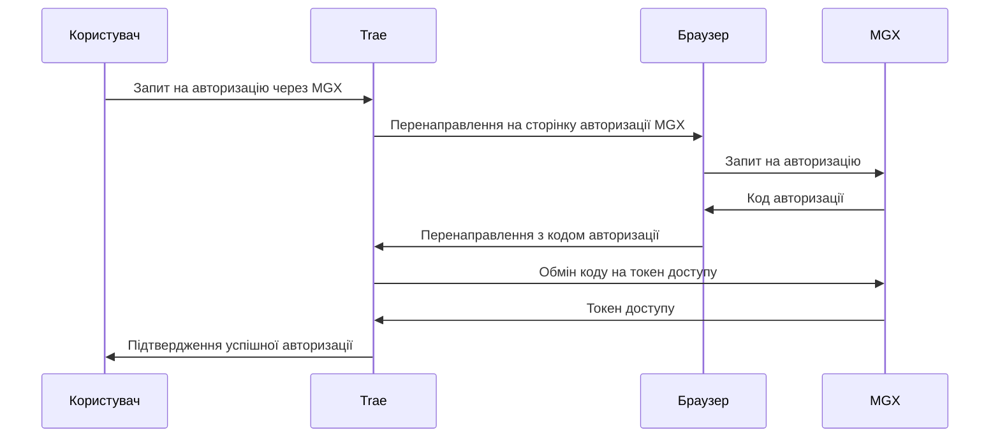
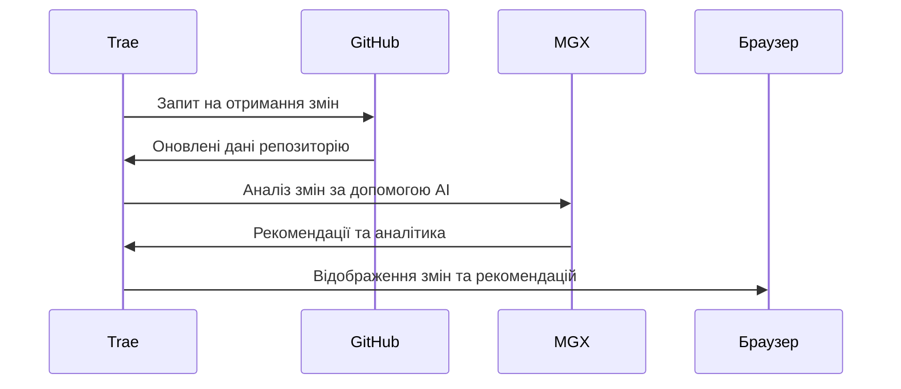
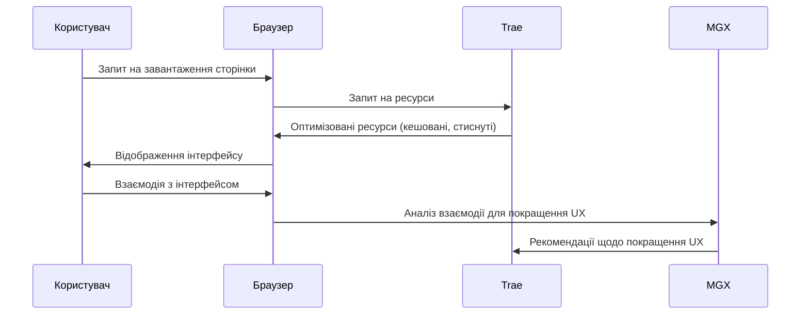

# Інтеграція Trae з MGX, GitHub та браузером

## Огляд системи взаємодії

Цей документ описує комплексну систему взаємодії між чотирма ключовими компонентами:

1. **Trae** - основний додаток, який надає інтерфейс користувача та керує взаємодією між іншими компонентами
2. **GitHub репозиторій** - сховище коду та ресурсів проекту
3. **Браузер** - середовище виконання для клієнтської частини додатку
4. **MGX (MetaGPT X)** - сервіс штучного інтелекту, що надає розширені можливості для розробки

## Алгоритми взаємодії

### 1. Авторизація та автентифікація



### 2. Синхронізація з GitHub репозиторієм



### 3. Оптимізація взаємодії з браузером



## Інструкції з налаштування

### 1. Налаштування інтеграції з MGX

1. Зареєструйтесь на платформі MGX та отримайте API ключ
2. Додайте API ключ у конфігурацію Trae:
   ```javascript
   // config/mgx.js
   export const MGX_CONFIG = {
     apiKey: process.env.MGX_API_KEY,
     endpoint: 'https://mgx.dev/api',
     version: 'v1'
   };
   ```
3. Налаштуйте перенаправлення OAuth у консолі MGX:
   - Redirect URI: `https://your-trae-app.com/api/auth/callback/mgx`

### 2. Налаштування інтеграції з GitHub

1. Створіть GitHub OAuth App у налаштуваннях організації або профілю
2. Додайте отримані Client ID та Client Secret у конфігурацію Trae:
   ```javascript
   // config/github.js
   export const GITHUB_CONFIG = {
     clientId: process.env.GITHUB_CLIENT_ID,
     clientSecret: process.env.GITHUB_CLIENT_SECRET,
     redirectUri: 'https://your-trae-app.com/api/auth/callback/github'
   };
   ```

### 3. Оптимізація для браузера

1. Налаштуйте кешування статичних ресурсів:
   ```javascript
   // next.config.js
   module.exports = {
     async headers() {
       return [
         {
           source: '/static/(.*)',
           headers: [
             {
               key: 'Cache-Control',
               value: 'public, max-age=31536000, immutable',
             },
           ],
         },
       ];
     },
   };
   ```

2. Впровадьте прогресивне завантаження зображень та ресурсів

## Розширення функціональності

### Необхідні доробки

1. **Розширення MGXIntegration компонента**:
   - Додати підтримку оновлення токенів
   - Реалізувати повний цикл OAuth 2.0
   - Додати функціонал для роботи з GitHub через MGX API

2. **Покращення взаємодії з браузером**:
   - Впровадити Service Worker для офлайн-функціональності
   - Оптимізувати завантаження ресурсів через стратегії кешування
   - Додати підтримку PWA (Progressive Web App)

3. **Інтеграція з GitHub**:
   - Реалізувати автоматичну синхронізацію змін
   - Додати підтримку GitHub Actions для CI/CD
   - Впровадити аналіз коду за допомогою MGX

## Рекомендації щодо безпеки

1. Використовуйте HTTPS для всіх з'єднань
2. Зберігайте токени в захищеному сховищі (не в localStorage)
3. Впровадьте CSRF захист для всіх API запитів
4. Регулярно оновлюйте залежності для усунення вразливостей
5. Використовуйте Content Security Policy для захисту від XSS атак

## Висновки

Інтеграція між Trae, GitHub, браузером та MGX надає потужну екосистему для розробки та підтримки проектів. Правильне налаштування взаємодії між цими компонентами забезпечує ефективний робочий процес, покращену безпеку та оптимальну продуктивність.

Для повної реалізації всіх можливостей інтеграції рекомендується впровадити всі запропоновані доробки та дотримуватися інструкцій з налаштування.